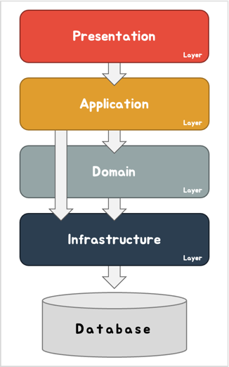
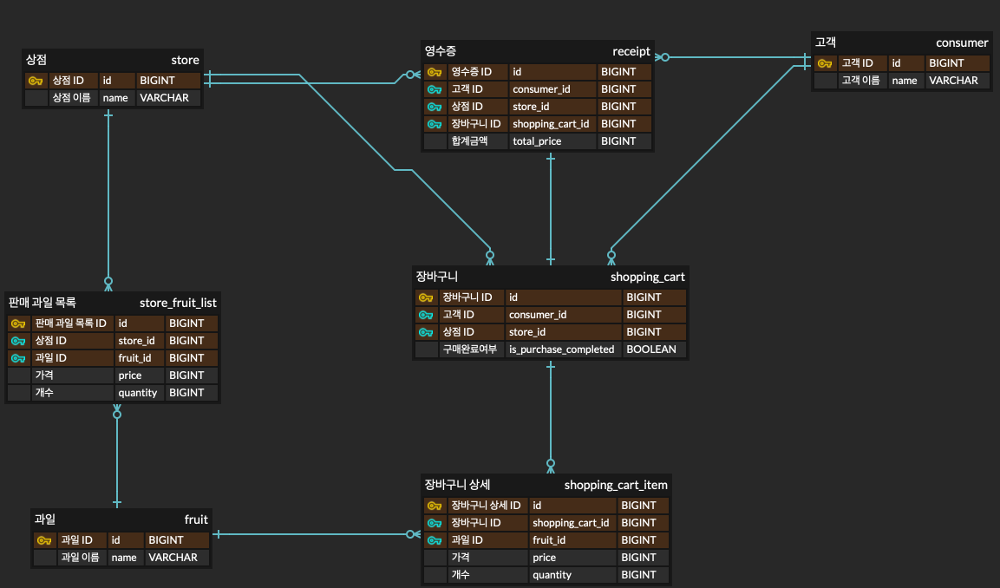

# 레이어드 아키텍처 학습

---

## 프로젝트 주요 기능과 목적

- 레이어드 아키텍처를 학습하기 위함입니다.
- 최종적으로 ***레이어드 아키텍처 Template*** 을 만드는 것이 목표입니다.

---

## 프로젝트 구조

### 의존관계

- **UI Layer**는 **Service Layer**만 의존해야한다.
- **Service Layer**는 **Repository Layer**만 의존해야한다.
    - 예외) **Application Layer**는 **Infrastructure Layer**에 의존할 수도 있다.

### 계층별 구성

- Presentation Layer
    - Controller
- Application Layer
    - Service
- Domain
    - Entity
    - Domain
- Infrastructure Layer
    - Repository
- DTO

### ERD

---

## 설치 방법

1. JDK 21 설치
2. Git pull
3. 어플리케이션 실행

---

## 테스트 방법

API 문서 : http://localhost:8080/swagger-ui/index.html  
API 문서 다운로드 (yaml) : http://localhost:8080/api-docs.yaml  
API 문서 다운로드 (json) : http://localhost:8080/api-docs

1. LayeredArchitectureApplication 을 실행합니다.
2. 위 Swagger 문서를 보고 API 를 호출 합니다.

---

## 라이브러리 정보

- spring-boot-starter (latest)
- spring-boot-starter-web (latest)
- spring-boot-starter-data-jpa (latest)
- spring-boot-starter-test (latest)
- spring-boot-starter-validation (latest)
- springdoc-openapi-starter-webmvc-ui (2.6.0)
- lombok (latest)
- h2 (latest)
- junit-platform-launcher (latest)
